# AI Classification Flow

## Overview

```mermaid
flowchart LR
    subgraph Input["📝 User Input"]
        TEXT[Text Input]
        VOICE[Voice Memo]
    end

    subgraph Transcription["🎤 Transcription"]
        VOICE --> WHISPER[OpenAI Whisper]
        WHISPER --> TRANSCRIPT[Transcribed Text]
    end

    subgraph Classification["🤖 AI Classification"]
        TEXT --> GPT[GPT-4o-mini]
        TRANSCRIPT --> GPT
        GPT --> RESULT[Classification Result]
    end

    subgraph Validation["✅ Validation"]
        RESULT --> ZOD[Zod Schema Validation]
        ZOD --> VALID{Valid?}
        VALID -->|Yes| ITEM[Create Item]
        VALID -->|No| REVIEW[Mark needsReview]
        REVIEW --> ITEM
    end

    subgraph Storage["💾 Storage"]
        ITEM --> DB[(PostgreSQL)]
    end
```



## GPT-4o-mini Classification Prompt


## Classification Logic


## Zod Schema Validation

```typescript
const ClassificationSchema = z.object({
  type: z.enum(["todo", "reminder", "idea", "note"]),
  title: z.string().min(1).max(200),
  details: z.string().nullable(),
  dueAt: z.string().datetime().nullable(),
  priority: z.enum(["P0", "P1", "P2"]).nullable(),
  tags: z.array(z.string()).default([]),
  confidence: z.number().min(0).max(1).optional(),
});
```

## Type Classification Rules

```mermaid
flowchart TB
    subgraph Rules["Classification Heuristics"]
        TODO["📋 TODO
        - Action items
        - Tasks to complete
        - 'Need to...', 'Should...'"]
        
        REMINDER["⏰ REMINDER
        - Time-specific
        - 'Remind me...', 'Don't forget...'
        - Has specific date/time"]
        
        IDEA["💡 IDEA
        - Creative thoughts
        - 'What if...', 'Could try...'
        - No urgency"]
        
        NOTE["📝 NOTE
        - Information storage
        - Facts, references
        - No action required"]
    end
```



## Priority Assignment

| Priority | Criteria | Examples |
|----------|----------|----------|
| **P0** (Urgent) | Immediate action, critical | "ASAP", "urgent", "emergency", today |
| **P1** (High) | Important, time-bound | Deadlines within 48h, "important" |
| **P2** (Normal) | Standard priority | Default, no urgency indicators |
| **null** | No priority | Notes, ideas without deadlines |

## Confidence Scoring

The AI returns a confidence score (0-1) based on:

- **High (0.8-1.0)**: Clear intent, specific details, matches patterns
- **Medium (0.5-0.8)**: Ambiguous phrasing, missing context
- **Low (0-0.5)**: Very unclear, multiple interpretations possible

Items with confidence < 0.7 are flagged as `needsReview: true` and appear in the Inbox for user verification.

## Error Handling


