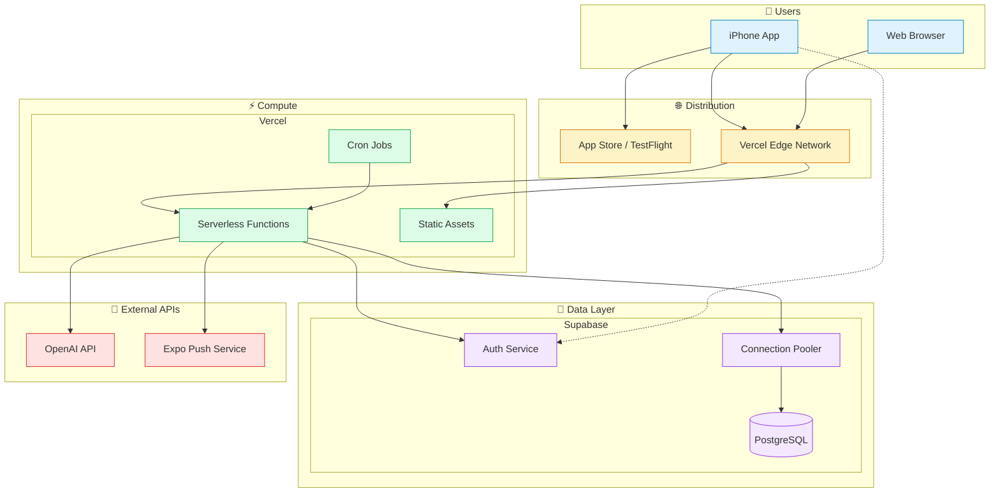
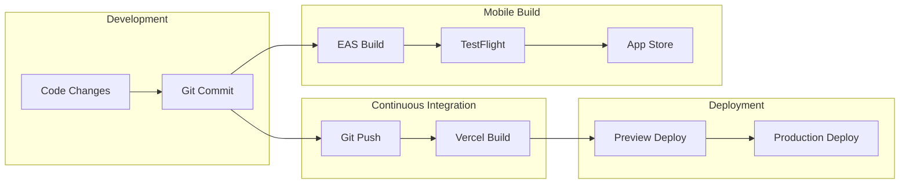
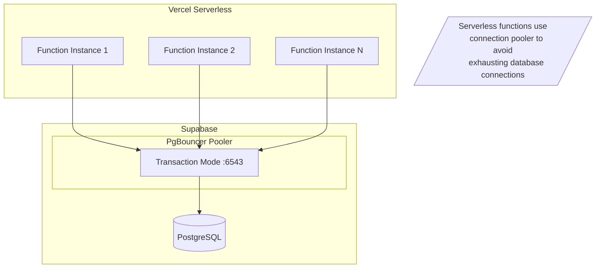
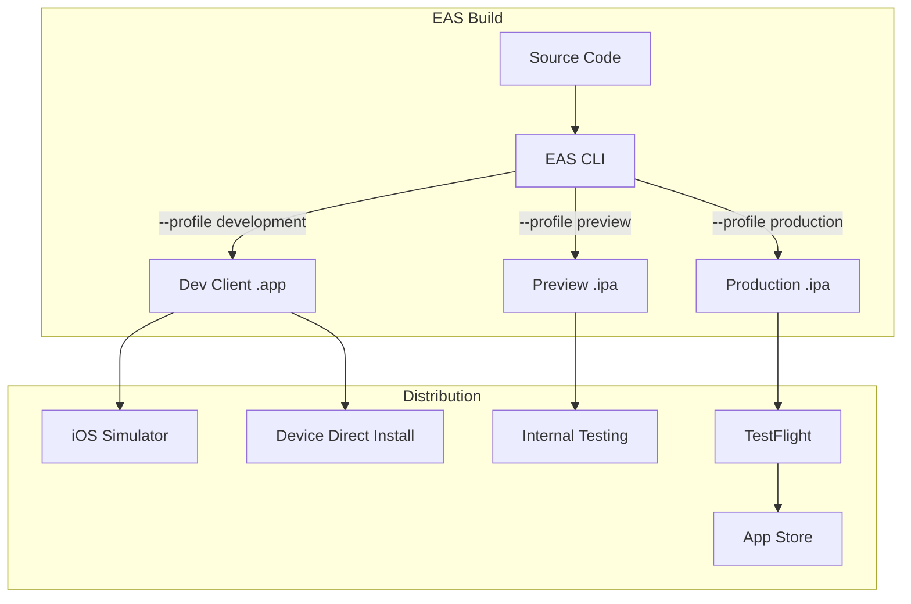
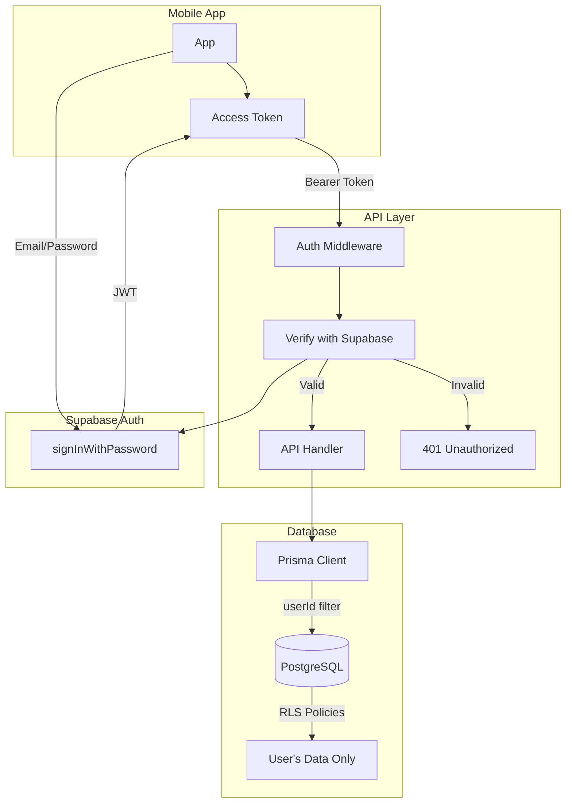

# Deployment Architecture

## Infrastructure Overview



## Environment Configuration

### Vercel Environment Variables

```
┌─────────────────────────────────┬────────────────────────────────────┐
│ Variable                        │ Description                        │
├─────────────────────────────────┼────────────────────────────────────┤
│ NEXT_PUBLIC_SUPABASE_URL        │ Supabase project URL               │
│ NEXT_PUBLIC_SUPABASE_ANON_KEY   │ Supabase anon/public key           │
│ SUPABASE_SERVICE_ROLE_KEY       │ Supabase service role (server)     │
│ DATABASE_URL                    │ PostgreSQL connection (pooler)     │
│ OPENAI_API_KEY                  │ OpenAI API key                     │
│ CRON_SECRET                     │ Secret for cron authentication     │
└─────────────────────────────────┴────────────────────────────────────┘
```

### EAS Build Secrets

```
┌─────────────────────────────────┬────────────────────────────────────┐
│ Secret                          │ Description                        │
├─────────────────────────────────┼────────────────────────────────────┤
│ EXPO_PUBLIC_API_BASE_URL        │ Vercel deployment URL              │
│ EXPO_PUBLIC_SUPABASE_URL        │ Supabase project URL               │
│ EXPO_PUBLIC_SUPABASE_ANON_KEY   │ Supabase anon/public key           │
└─────────────────────────────────┴────────────────────────────────────┘
```

### Supabase Configuration

```
┌─────────────────────────────────┬────────────────────────────────────┐
│ Setting                         │ Value                              │
├─────────────────────────────────┼────────────────────────────────────┤
│ Site URL                        │ https://[app].vercel.app           │
│ Redirect URLs                   │ https://[app].vercel.app/**        │
│                                 │ ai-todo://auth/callback            │
└─────────────────────────────────┴────────────────────────────────────┘
```

## CI/CD Pipeline



## Database Connection Strategy



## Cron Job Configuration

```yaml
# vercel.json
{
  "crons": [
    {
      "path": "/api/cron/daily-digest?secret=${CRON_SECRET}",
      "schedule": "0 8 * * *"  # Daily at 08:00 UTC
    }
  ]
}
```

## Mobile App Distribution



## Security Architecture



