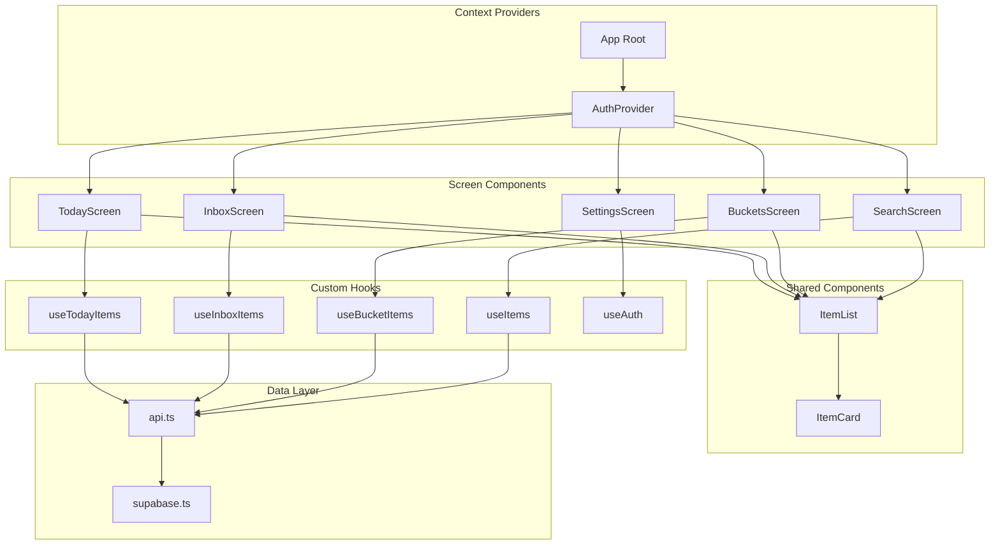

# Mobile App Structure

## Navigation Flow

```mermaid
flowchart TB
    subgraph App["App Entry"]
        ROOT[_layout.tsx]
        ROOT --> AUTH_CHECK{Authenticated?}
    end

    subgraph Auth["Auth Flow"]
        AUTH_CHECK -->|No| LOGIN[auth/login.tsx]
        LOGIN --> SIGNIN[Sign In Form]
        LOGIN --> SIGNUP[Sign Up Form]
        SIGNIN --> AUTH_CHECK
        SIGNUP --> AUTH_CHECK
    end

    subgraph Tabs["Main Tabs"]
        AUTH_CHECK -->|Yes| TAB_NAV[Tab Navigator]
        TAB_NAV --> TODAY["📅 Today"]
        TAB_NAV --> INBOX["📥 Inbox"]
        TAB_NAV --> BUCKETS["📦 Buckets"]
        TAB_NAV --> SEARCH["🔍 Search"]
        TAB_NAV --> SETTINGS["⚙️ Settings"]
    end

    subgraph Modals["Modal Screens"]
        TAB_NAV --> ADD[➕ Add Button]
        ADD --> TEXT_CAPTURE[capture/text.tsx]
        ADD --> VOICE_CAPTURE[capture/voice.tsx]
        TODAY --> ITEM_DETAIL[item/[id].tsx]
        INBOX --> ITEM_DETAIL
        BUCKETS --> ITEM_DETAIL
        SEARCH --> ITEM_DETAIL
    end

    classDef auth fill:#fef3c7,stroke:#d97706
    classDef tabs fill:#e0f2fe,stroke:#0284c7
    classDef modals fill:#f3e8ff,stroke:#9333ea

    class LOGIN,SIGNIN,SIGNUP auth
    class TODAY,INBOX,BUCKETS,SEARCH,SETTINGS tabs
    class TEXT_CAPTURE,VOICE_CAPTURE,ITEM_DETAIL modals
```

## File Structure

```
apps/mobile/
├── app/                          # Expo Router pages
│   ├── _layout.tsx               # Root layout (AuthProvider)
│   ├── (tabs)/                   # Tab group
│   │   ├── _layout.tsx           # Tab bar configuration
│   │   ├── index.tsx             # Today screen
│   │   ├── inbox.tsx             # Inbox (needs review)
│   │   ├── buckets.tsx           # Buckets (by type)
│   │   ├── search.tsx            # Search items
│   │   └── settings.tsx          # User settings
│   ├── auth/
│   │   └── login.tsx             # Sign in/up screen
│   ├── capture/
│   │   ├── text.tsx              # Text input capture
│   │   └── voice.tsx             # Voice recording
│   └── item/
│       └── [id].tsx              # Item detail/edit
├── src/
│   ├── components/               # Reusable components
│   │   ├── ItemCard.tsx
│   │   ├── ItemList.tsx
│   │   └── ...
│   ├── hooks/                    # Custom hooks
│   │   ├── useAuth.tsx           # Auth context & hook
│   │   └── useItems.ts           # Items data fetching
│   └── lib/                      # Utilities
│       ├── api.ts                # API client
│       ├── supabase.ts           # Supabase client
│       └── notifications.ts      # Push notifications
├── assets/                       # App icons & images
├── app.json                      # Expo config
└── eas.json                      # EAS Build config
```

## Component Hierarchy



## Screen Descriptions

### Today Screen
- Shows overdue items, items due today, and high-priority items
- Greeting message with date
- Pull-to-refresh for updates

### Inbox Screen  
- Shows items that need review (AI confidence low)
- Items can be edited to correct AI classification

### Buckets Screen
- Horizontal tab navigation: Todo | Reminder | Idea | Note
- Filtered list by item type

### Search Screen
- Full-text search across title, details, tags
- Debounced search input
- Results as item list

### Settings Screen
- Daily digest toggle
- Digest time picker
- Timezone selector
- Sign out button
- Test push notification button

