# Sequence Diagrams

## 1. User Authentication Flow

## 2. Text Input Ingestion Flow

## 3. Voice Input Ingestion Flow

## 4. Daily Digest Cron Flow

```mermaid
sequenceDiagram
    autonumber
    participant Vercel as Vercel Cron
    participant API as /api/cron/daily-digest
    participant DB as PostgreSQL
    participant Expo as Expo Push Service
    participant Device as User's iPhone

    Vercel->>API: GET /api/cron/daily-digest?secret=xxx
    Note over API: Runs daily at 08:00 UTC
    API->>DB: Get users with digest enabled
    loop For each user
        API->>API: Check user timezone & preferred time
        alt Time matches
            API->>DB: Get user's items (overdue, due today, priorities)
            API->>API: Generate digest content
            API->>DB: Get user's push tokens
            API->>Expo: Send push notification
            Expo-->>Device: 📋 Your Daily Digest
            API->>DB: Log digest sent
        end
    end
    API-->>Vercel: {sent: N, skipped: M}
```

## 5. Push Token Registration Flow

## 6. Item Update Flow (Optimistic UI)

