# System Architecture

```mermaid
flowchart TB
    subgraph Mobile["📱 Mobile App (Expo/React Native)"]
        MA[Mobile App]
        MA --> |"Supabase Auth"| AUTH_M[Auth Provider]
        MA --> |"REST API"| API_CLIENT[API Client]
        MA --> |"Push Tokens"| NOTIF[Notifications]
    end

    subgraph Vercel["☁️ Vercel (Next.js Backend)"]
        subgraph API["API Routes"]
            ITEMS_API["/api/items"]
            INGEST_API["/api/ingest/*"]
            SETTINGS_API["/api/settings"]
            PUSH_API["/api/push/*"]
            CRON_API["/api/cron/daily-digest"]
        end
        
        subgraph Services["Services"]
            AUTH_SVC[Auth Service]
            AGENT[AI Agent]
            PUSH_SVC[Push Service]
            DIGEST_SVC[Digest Service]
        end
    end

    subgraph External["🌐 External Services"]
        SUPABASE[(Supabase)]
        OPENAI[OpenAI API]
        EXPO_PUSH[Expo Push Service]
    end

    subgraph Supabase_Detail["Supabase"]
        SB_AUTH[Auth]
        SB_DB[(PostgreSQL)]
    end

    %% Mobile connections
    API_CLIENT --> ITEMS_API
    API_CLIENT --> INGEST_API
    API_CLIENT --> SETTINGS_API
    API_CLIENT --> PUSH_API
    AUTH_M --> SB_AUTH
    NOTIF --> EXPO_PUSH

    %% API to Services
    ITEMS_API --> AUTH_SVC
    INGEST_API --> AGENT
    SETTINGS_API --> AUTH_SVC
    PUSH_API --> PUSH_SVC
    CRON_API --> DIGEST_SVC

    %% Services to External
    AUTH_SVC --> SB_AUTH
    AUTH_SVC --> SB_DB
    AGENT --> OPENAI
    AGENT --> SB_DB
    PUSH_SVC --> EXPO_PUSH
    PUSH_SVC --> SB_DB
    DIGEST_SVC --> SB_DB
    DIGEST_SVC --> PUSH_SVC

    %% Styling
    classDef mobile fill:#e0f2fe,stroke:#0284c7
    classDef vercel fill:#fef3c7,stroke:#d97706
    classDef external fill:#f3e8ff,stroke:#9333ea
    classDef database fill:#dcfce7,stroke:#16a34a

    class MA,AUTH_M,API_CLIENT,NOTIF mobile
    class ITEMS_API,INGEST_API,SETTINGS_API,PUSH_API,CRON_API,AUTH_SVC,AGENT,PUSH_SVC,DIGEST_SVC vercel
    class OPENAI,EXPO_PUSH external
    class SUPABASE,SB_AUTH,SB_DB database
```

## Components Overview

### Mobile App (Expo SDK 54)
- **React Native** with Expo Router for navigation
- **Supabase JS** for authentication
- **expo-notifications** for push notifications
- **expo-audio** for voice recording

### Backend (Next.js 16 on Vercel)
- **App Router** API routes
- **Prisma ORM** for database access
- **Supabase Auth** verification for Bearer tokens
- **OpenAI GPT-4o-mini** for AI classification
- **OpenAI Whisper** for voice transcription
- **expo-server-sdk** for push notifications

### Database (Supabase PostgreSQL)
- **Items** - Tasks, reminders, ideas, notes
- **UserSettings** - User preferences
- **DevicePushToken** - Expo push tokens
- **DigestLog** - Daily digest history

### External Services
- **Supabase** - Auth + PostgreSQL database
- **OpenAI** - GPT-4o-mini (classification) + Whisper (transcription)
- **Expo Push** - Push notification delivery
- **Vercel Cron** - Scheduled daily digest

